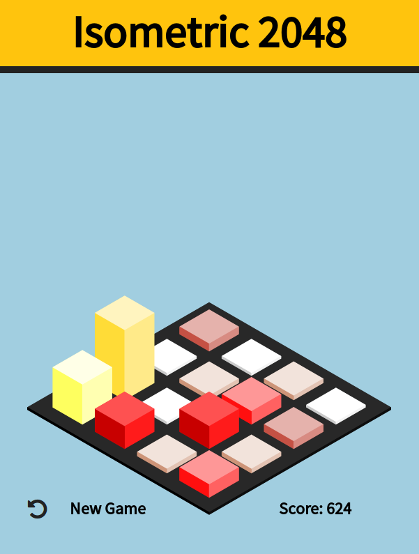

# [Isometric-2048]()

A less flat version of 2048, by [Mohamed Adam Chaieb](http://themoechaieb.com).

A remake of [2048](http://gabrielecirulli.github.io/2048/), in isometric 3D.

#Screenshot

#License

Isometric 2048 is published under the MIT License.
